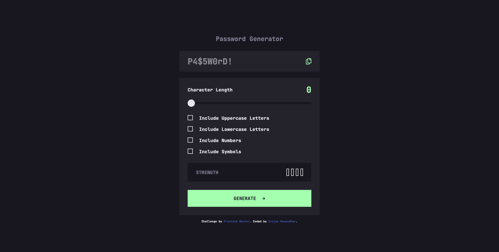
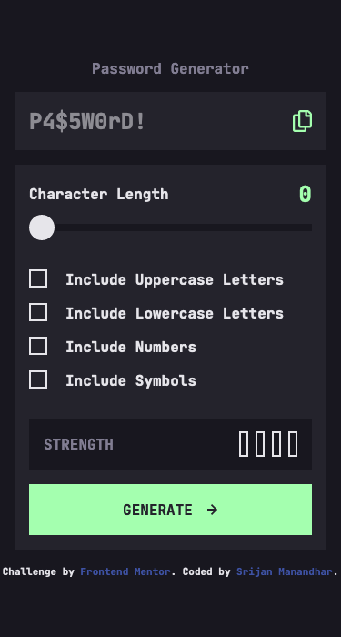

# Frontend Mentor - Password generator app solution

This is a solution to the [Password generator app challenge on Frontend Mentor](https://www.frontendmentor.io/challenges/password-generator-app-Mr8CLycqjh). Frontend Mentor challenges help you improve your coding skills by building realistic projects.

## Table of contents

- [Overview](#overview)
  - [The challenge](#the-challenge)
  - [Screenshot](#screenshot)
  - [Links](#links)
- [My process](#my-process)
  - [Built with](#built-with)
  - [What I learned](#what-i-learned)
  - [Continued development](#continued-development)
  - [Useful resources](#useful-resources)
- [Author](#author)
- [Acknowledgments](#acknowledgments)

## Overview

### The challenge

Users should be able to:

- Generate a password based on the selected inclusion options
- Copy the generated password to the computer's clipboard
- See a strength rating for their generated password
- View the optimal layout for the interface depending on their device's screen size
- See hover and focus states for all interactive elements on the page

### Screenshot




### Links

- Solution URL: [https://github.com/srijanss/password-generator-app](https://github.com/srijanss/password-generator-app)
- Live Site URL: [https://srijanss.github.io/password-generator-app/](https://srijanss.github.io/password-generator-app/)

## My process

### Built with

- Semantic HTML5 markup
- CSS custom properties
- Flexbox
- Mobile-first workflow
- Web Components
- [Vite](https://vitejs.dev/) - Lightweight frontend tooling
- [PostCSS](https://postcss.org/) - Tool to transform CSS using plugins

### What I learned

```html
<label for="id_uppercase_letters">
  <input type="checkbox" id="id_uppercase_letters" name="password-options" />
  <custom-checkbox>Include Uppercase Letters</custom-checkbox>
</label>
```

Passing the text to the custom web components. And this was possible by adding <slot></slot> element in the CustomCheckbox component.

```css
.strength-meter {
  &.too-weak {
    & .strength-meter__bar:nth-child(1) {
      background-color: var(--color-too-weak);
      border: none;
    }
  }
  &.weak {
    & .strength-meter__bar:nth-child(-n + 2) {
      background-color: var(--color-weak);
      border: none;
    }
  }
  &.medium {
    & .strength-meter__bar:nth-child(-n + 3) {
      background-color: var(--color-medium);
      border: none;
    }
  }
  &.strong {
    & .strength-meter__bar {
      background-color: var(--color-primary);
      border: none;
    }
  }
}
```

To show the strenght meter bars and apply colors to it, I found the solution using CSS and nth-child pseudo selector. I had some idea about passing number to nth-child which selects the corresponding child of an element. However, the use of :nth-child(-n + 2) was new to me, and it was really helpful for this case.

```css
:host(:state(checked)) .checkbox {
  border: none;
  background-color: var(--color-primary);
  display: flex;
  justify-content: center;
  align-items: center;
  & * {
    display: block;
  }
}
```

```js
export default class CheckboxComponent extends HTMLElement {
  constructor() {
    super();
    this.addEventListener("click", (e) => this._onClick(e));
    this._internals = this.attachInternals();
  }

  get checked() {
    return this._internals.states.has("checked");
  }

  set checked(flag) {
    if (flag) {
      this._internals.states.add("checked");
    } else {
      this._internals.states.delete("checked");
    }
  }

  _onClick(event) {
    this.checked = !this.checked;
  }
  ...
}
```

By making this custom component I got a chance to go deep into Web components and how we can set internal states. And same states can be used as pseudo selectors in CSS to apply different styles.

```js
export default class RangeSliderComponent extends HTMLElement {
  constructor() {
    self = super();
  }
  ...
  handleDragStart(event) {
    event.preventDefault();
    this.isDragging = true;
    document.body.style.userSelect = "none";
  }

  handleDragMove(event) {
    if (event.changedTouches) {
      event.clientX = event.changedTouches[0].clientX;
    }
    if (this.isDragging) {
      const position = event.clientX;
      if (
        position >= this.startX + this.offsetX &&
        position <= this.endX + this.offsetX
      ) {
        this.trackCrossSize = position - this.startX - this.offsetX;
        this.sliderThumb.style.left = `${this.trackCrossSize}px`;
        this.sliderTrack.style.setProperty(
          "--track-cross-size",
          `${this.trackCrossSize + 5}px`
        );
      }
    }
  }

  handleDragEnd(event) {
    this.isDragging = false;
    document.body.style.userSelect = "";
  }
```

I had some issue making the custom range slider. Adding CSS to the built in input['range'] was too time consuming and it was not looking like in the design. So, I decided to make custom range slider. To make it work I had to handle events like mousedown, mousemove and mouseup. And based on the width of the slider track and screen position of the thumb, we need to calculate theleft or right to movement based on how much the thumb was dragged across. And calculated the percentage of the movement to set value based on the max attribute of the default range slider. Similar, events listener for touch enabled devices were also done using touch events like touchstart, touchmove and touchend.

```js
getPasswordStrengthBasedOnRegex(password) {
    const hasUppercaseLettersRegex = new RegExp(`[${this.uppercaseLetters}]`);
    const hasLowercaseLettersRegex = new RegExp(`[${this.lowercaseLetters}]`);
    const hasNumbersRegex = new RegExp(`[${this.numbers}]`);
    const hasSymbolsRegex = new RegExp(`[${this.symbols}]`);
    let strength = 0;
    if (password.length > 8) strength += 1;
    if (password.match(hasUppercaseLettersRegex)) strength += 1;
    if (password.match(hasLowercaseLettersRegex)) strength += 1;
    if (password.match(hasNumbersRegex)) strength += 1;
    if (password.match(hasSymbolsRegex)) strength += 2;
    return strength;
  }
```

I used RegExp constructor method to match the generated password and calculate the strength.

### Continued development

I would like to further study about the different use cases of web components. Making the CheckboxComponent was really fun. I would like to work further on RangeSliderComponent, since currently only draging the slider thumb works. But if we click anywhere on the track it will now set the range value. I would also read more about <slot></slot> and <template></template> elements and how to use it meaningfully in web components.

### Useful resources

- [Web components - Custom State Set](https://developer.mozilla.org/en-US/docs/Web/API/CustomStateSet#browser_compatibility) - Very helpful resource about CustomStateSet in web components.
- [getComputedStyle](https://developer.mozilla.org/en-US/docs/Web/API/Window/getComputedStyle) - Helpful resource about how to get CSS properties of an element
- [Web API ClipBoard](https://developer.mozilla.org/en-US/docs/Web/API/Clipboard) - Helpful resource about how to save data to clipboard.

## Author

- Website - [Srijan Manandhar](https://github.com/srijanss)
- Frontend Mentor - [@srijanss](https://www.frontendmentor.io/profile/srijanss)
